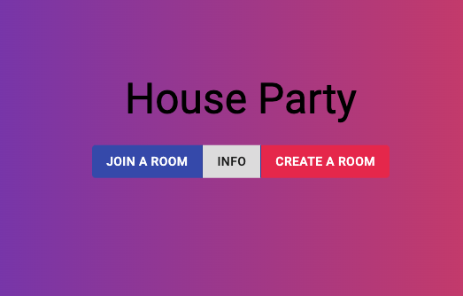
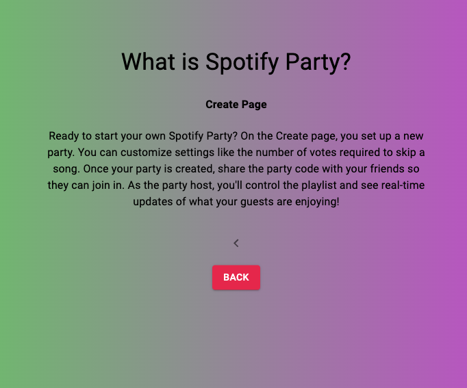
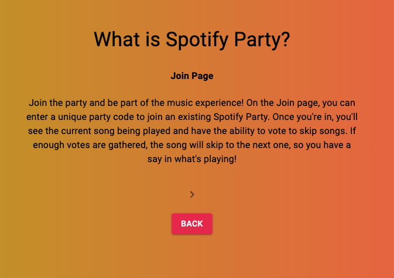
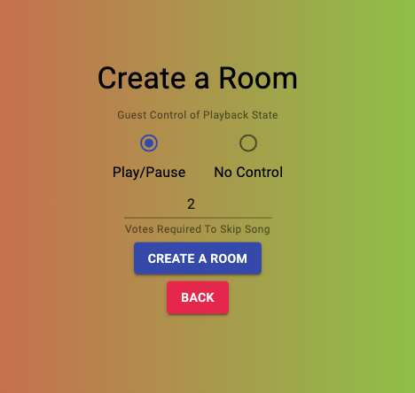
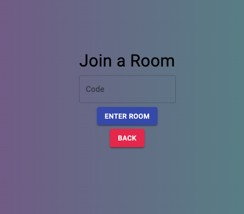
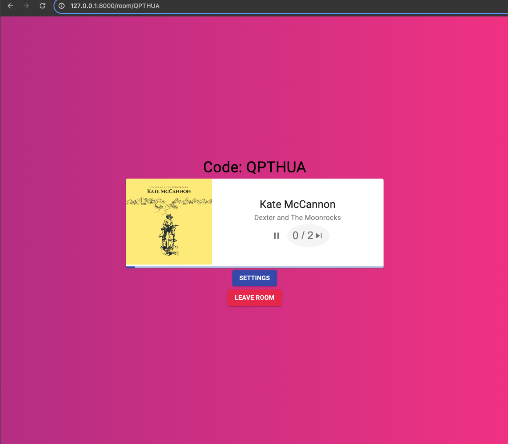

# Spotify Party App

## Description

Spotify Party App is an interactive web application that allows users to join or create music listening parties. Users can view the current song being played, and after a set number of skip votes, the song will automatically skip to the next one.

## Features

- Join existing music parties with a unique code.
- Create new music parties and customize skip vote settings.
- Real-time updates on the current song being played.
- Interactive voting system for skipping songs.

## Prerequisites

Before you begin, ensure you have met the following requirements:

- You have installed the latest version of [Node.js and npm](https://nodejs.org/en/download/).
- You have installed Python. Download it from [python.org](https://www.python.org/downloads/).
- You have a `<Windows/Linux/Mac>` machine.

## Installing Spotify Party App

To install Spotify Party App, follow these steps:

1. Clone the repository:
   Open a terminal (Mac) or command prompt/PowerShell (Windows) and run the following command to clone the repository. Replace YOUR_REPOSITORY_URL with the actual URL of your GitHub repository.
   `git clone YOUR_REPOSITORY_URL`

2. Navigate to the Project Directory:
   After cloning, navigate to the project directory: `cd name-of-the-repository/frontend`

3. Install Node Dependencies:
   Within the project directory, run: `npm install`

### Running Spotify Party App

On Mac:

1. cd into music_controller: `cd music_controller`
2. Run the Python Server: `python3 ./manage.py runserver`
   This starts the Django server on http://127.0.0.1:8000/

3. Starting the Development Server for Frontend:
   In a new terminal tab/window, cd into frontend: `cd frontend` `npm run dev`

## Screenshots

This app does have a dynamic gradient background with randomized colors so the colors may vary.

## Contact

All of my contact info needed is in my github bio.

## Acknowledgments

- This was my first Django and Spotify API project, it was a lot of fun and a valuable learning experience
- Thanks to Tech With Tim on Youtube for the Python tutorial
